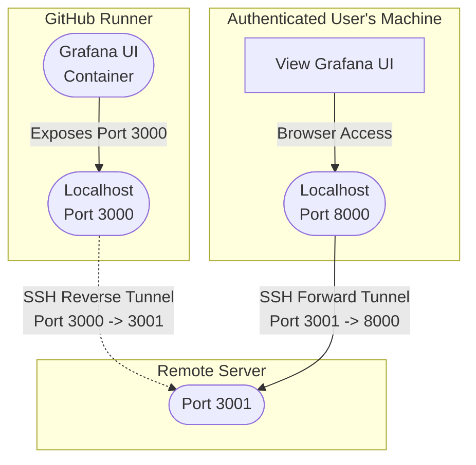

# Github workflows

## Traces

`tracing.yml`:
This gh action will check if PRs are marked with the `enable tracing` label. If so, on PR creation, sycronization, or labeling, then a sample CI workflow is kicked off that generates traces.

Ephemeral OTEL collector, Grafana Tempo, and Grafana UI containers are deployed and kept up while the workflow executes (for 500 seconds). Ngrok tunnels are used to expose the Grafana UI container outside the github runner. 

To view such traces, fork this repository and configure the following secrets:
    NGROK_AUTH_TOKEN
    NGROK_USER
    NGROK_PASSWORD

The tracing workflow will log the exposed endpoint, which you can paste into any browser. Visit `/explore` and select traces to view traces.

`tracing-ssh.yml`:
This is a variant of `tracing.yml` that uses ssh reverse port forwarding and vanilla port forwarding instead of ngrok:

